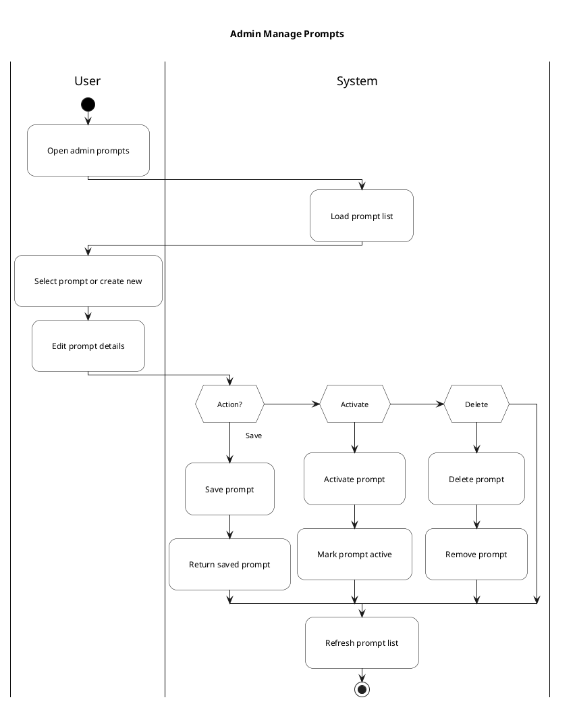

# Admin Manage Prompts

```plantuml
@startuml
skinparam shadowing false
skinparam backgroundColor White
skinparam activityBorderColor Black
skinparam activityBackgroundColor White
skinparam activityDiamondBorderColor Black
skinparam activityDiamondBackgroundColor White
skinparam activityStartColor Black
skinparam activityEndColor Black
skinparam swimlaneBorderColor Black
skinparam swimlaneBorderThickness 1
skinparam swimlaneTitleBackgroundColor White
skinparam swimlaneTitleBorderColor Black
skinparam swimlaneTitleBorderThickness 1
skinparam padding 20
title Admin Manage Prompts
|User|
start
:Open admin prompts;
|System|
:Load prompt list;
|User|
:Select prompt or create new;
:Edit prompt details;
|System|
if (Action?) then (Save)
:Save prompt;
:Return saved prompt;
elseif (Activate)
:Activate prompt;
:Mark prompt active;
elseif (Delete)
:Delete prompt;
:Remove prompt;
endif
:Refresh prompt list;
stop
@enduml
```
