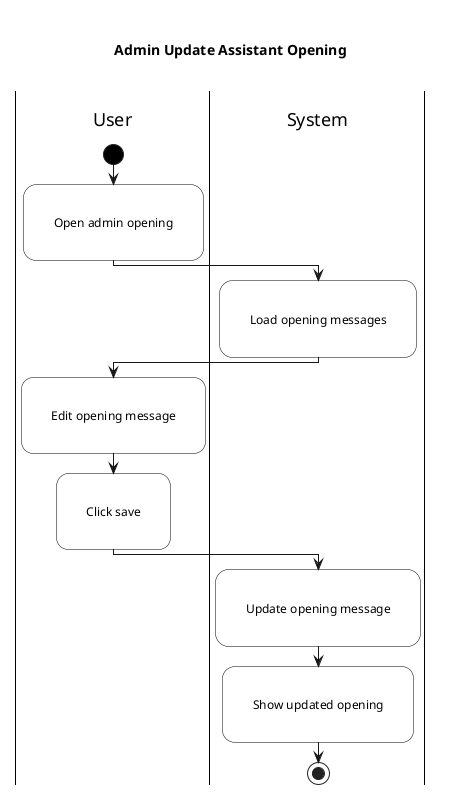

# Admin Update Assistant Opening

```plantuml
@startuml
skinparam shadowing false
skinparam backgroundColor White
skinparam activityBorderColor Black
skinparam activityBackgroundColor White
skinparam activityDiamondBorderColor Black
skinparam activityDiamondBackgroundColor White
skinparam activityStartColor Black
skinparam activityEndColor Black
skinparam swimlaneBorderColor Black
skinparam swimlaneBorderThickness 1
skinparam swimlaneTitleBackgroundColor White
skinparam swimlaneTitleBorderColor Black
skinparam swimlaneTitleBorderThickness 1
skinparam padding 20
title Admin Update Assistant Opening
|User|
start
:Open admin opening;
|System|
:Load opening messages;
|User|
:Edit opening message;
:Click save;
|System|
:Update opening message;
:Show updated opening;
stop
@enduml
```
