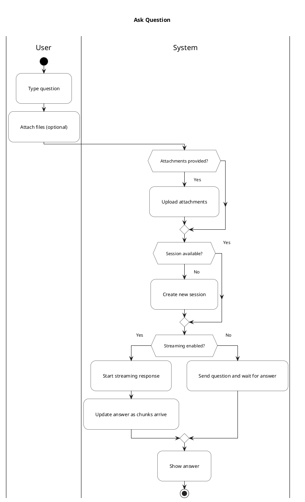

# Ask Question

```plantuml
@startuml
skinparam shadowing false
skinparam backgroundColor White
skinparam activityBorderColor Black
skinparam activityBackgroundColor White
skinparam activityDiamondBorderColor Black
skinparam activityDiamondBackgroundColor White
skinparam activityStartColor Black
skinparam activityEndColor Black
skinparam swimlaneBorderColor Black
skinparam swimlaneBorderThickness 1
skinparam swimlaneTitleBackgroundColor White
skinparam swimlaneTitleBorderColor Black
skinparam swimlaneTitleBorderThickness 1
skinparam padding 20
title Ask Question
|User|
start
:Type question;
:Attach files (optional);
|System|
if (Attachments provided?) then (Yes)
:Upload attachments;
endif
if (Session available?) then (Yes)
else (No)
:Create new session;
endif
if (Streaming enabled?) then (Yes)
:Start streaming response;
:Update answer as chunks arrive;
else (No)
:Send question and wait for answer;
endif
:Show answer;
stop
@enduml
```
