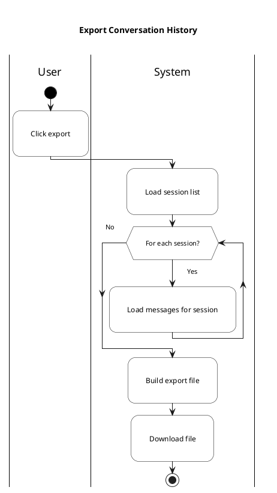

# Export Conversation History

```plantuml
@startuml
skinparam shadowing false
skinparam backgroundColor White
skinparam activityBorderColor Black
skinparam activityBackgroundColor White
skinparam activityDiamondBorderColor Black
skinparam activityDiamondBackgroundColor White
skinparam activityStartColor Black
skinparam activityEndColor Black
skinparam swimlaneBorderColor Black
skinparam swimlaneBorderThickness 1
skinparam swimlaneTitleBackgroundColor White
skinparam swimlaneTitleBorderColor Black
skinparam swimlaneTitleBorderThickness 1
skinparam padding 20
title Export Conversation History
|User|
start
:Click export;
|System|
:Load session list;
while (For each session?) is (Yes)
:Load messages for session;
endwhile (No)
:Build export file;
:Download file;
stop
@enduml
```
