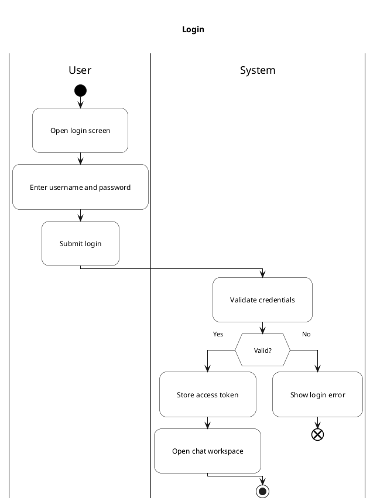

# Login

```plantuml
@startuml
skinparam shadowing false
skinparam backgroundColor White
skinparam activityBorderColor Black
skinparam activityBackgroundColor White
skinparam activityDiamondBorderColor Black
skinparam activityDiamondBackgroundColor White
skinparam activityStartColor Black
skinparam activityEndColor Black
skinparam swimlaneBorderColor Black
skinparam swimlaneBorderThickness 1
skinparam swimlaneTitleBackgroundColor White
skinparam swimlaneTitleBorderColor Black
skinparam swimlaneTitleBorderThickness 1
skinparam padding 20
title Login
|User|
start
:Open login screen;
:Enter username and password;
:Submit login;
|System|
:Validate credentials;
if (Valid?) then (Yes)
:Store access token;
:Open chat workspace;
else (No)
:Show login error;
end
endif
stop
@enduml
```
