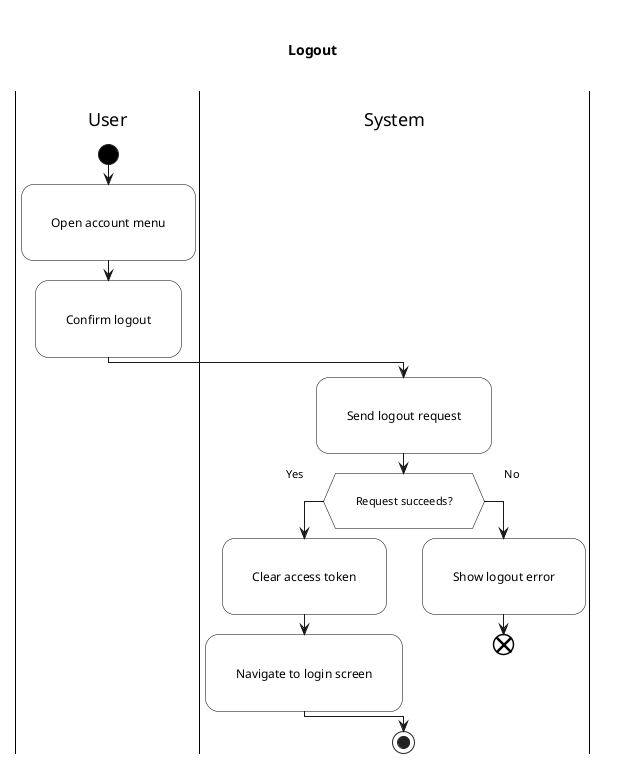

# Logout

```plantuml
@startuml
skinparam shadowing false
skinparam backgroundColor White
skinparam activityBorderColor Black
skinparam activityBackgroundColor White
skinparam activityDiamondBorderColor Black
skinparam activityDiamondBackgroundColor White
skinparam activityStartColor Black
skinparam activityEndColor Black
skinparam swimlaneBorderColor Black
skinparam swimlaneBorderThickness 1
skinparam swimlaneTitleBackgroundColor White
skinparam swimlaneTitleBorderColor Black
skinparam swimlaneTitleBorderThickness 1
skinparam padding 20
title Logout
|User|
start
:Open account menu;
:Confirm logout;
|System|
:Send logout request;
if (Request succeeds?) then (Yes)
:Clear access token;
:Navigate to login screen;
else (No)
:Show logout error;
end
endif
stop
@enduml
```
