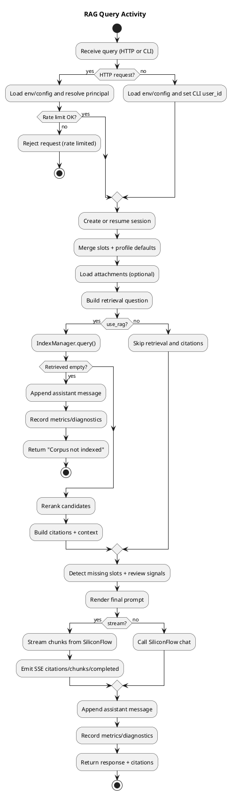
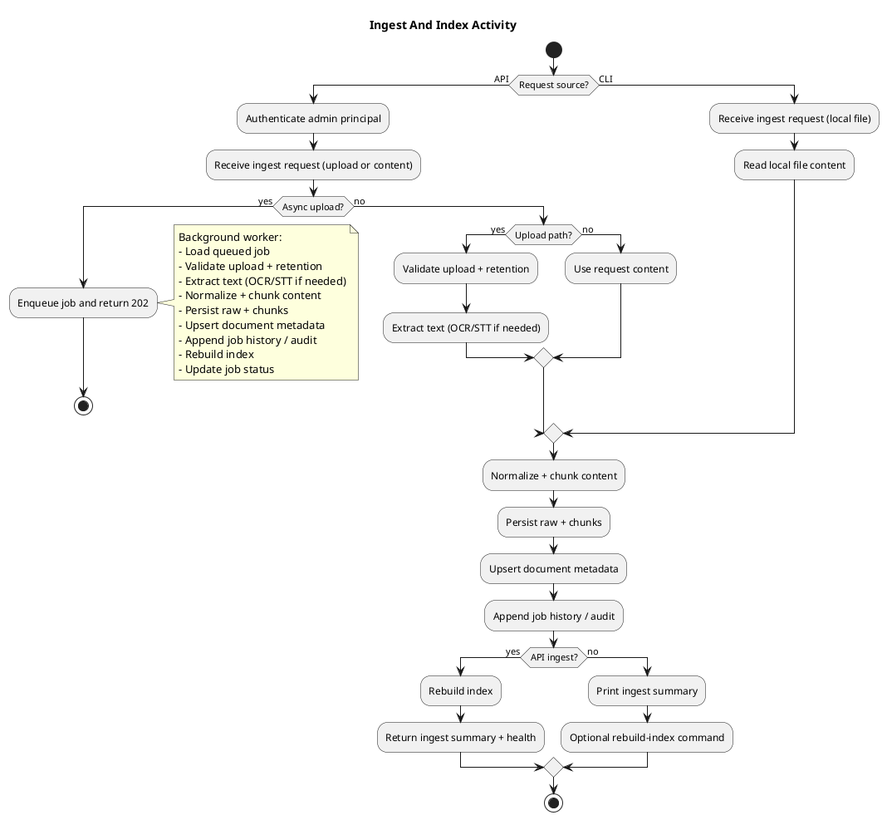
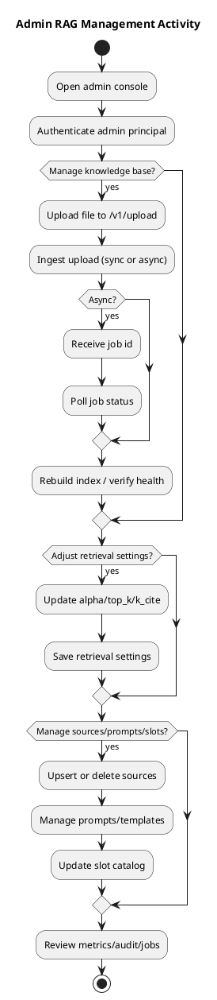

# Activity Diagram (PlantUML)

## RAG Query Activity (HTTP + CLI)

```plantuml
@startuml
title RAG Query Activity

start
:Receive query (HTTP or CLI);
if (HTTP request?) then (yes)
  :Load env/config and resolve principal;
  if (Rate limit OK?) then (yes)
  else (no)
    :Reject request (rate limited);
    stop
  endif
else (no)
  :Load env/config and set CLI user_id;
endif
:Create or resume session;
:Merge slots + profile defaults;
:Load attachments (optional);
:Build retrieval question;
if (use_rag?) then (yes)
  :IndexManager.query();
  if (Retrieved empty?) then (yes)
    :Append assistant message;
    :Record metrics/diagnostics;
    :Return "Corpus not indexed";
    stop
  endif
  :Rerank candidates;
  :Build citations + context;
else (no)
  :Skip retrieval and citations;
endif
:Detect missing slots + review signals;
:Render final prompt;
if (stream?) then (yes)
  :Stream chunks from SiliconFlow;
  :Emit SSE citations/chunks/completed;
else (no)
  :Call SiliconFlow chat;
endif
:Append assistant message;
:Record metrics/diagnostics;
:Return response + citations;
stop
@enduml
```

## Ingest + Index Activity (Upload + File)

```plantuml
@startuml
title Ingest And Index Activity

start
if (Request source?) then (API)
  :Authenticate admin principal;
  :Receive ingest request (upload or content);
  if (Async upload?) then (yes)
    :Enqueue job and return 202;
    note right
      Background worker:
      - Load queued job
      - Validate upload + retention
      - Extract text (OCR/STT if needed)
      - Normalize + chunk content
      - Persist raw + chunks
      - Upsert document metadata
      - Append job history / audit
      - Rebuild index
      - Update job status
    end note
    stop
  else (no)
    if (Upload path?) then (yes)
      :Validate upload + retention;
      :Extract text (OCR/STT if needed);
    else (no)
      :Use request content;
    endif
  endif
else (CLI)
  :Receive ingest request (local file);
  :Read local file content;
endif
:Normalize + chunk content;
:Persist raw + chunks;
:Upsert document metadata;
:Append job history / audit;
if (API ingest?) then (yes)
  :Rebuild index;
  :Return ingest summary + health;
else (no)
  :Print ingest summary;
  :Optional rebuild-index command;
endif
stop
@enduml
```

## Admin RAG Management Activity

```plantuml
@startuml
title Admin RAG Management Activity

start
:Open admin console;
:Authenticate admin principal;
if (Manage knowledge base?) then (yes)
  :Upload file to /v1/upload;
  :Ingest upload (sync or async);
  if (Async?) then (yes)
    :Receive job id;
    :Poll job status;
  endif
  :Rebuild index / verify health;
endif
if (Adjust retrieval settings?) then (yes)
  :Update alpha/top_k/k_cite;
  :Save retrieval settings;
endif
if (Manage sources/prompts/slots?) then (yes)
  :Upsert or delete sources;
  :Manage prompts/templates;
  :Update slot catalog;
endif
:Review metrics/audit/jobs;
stop
@enduml
```
