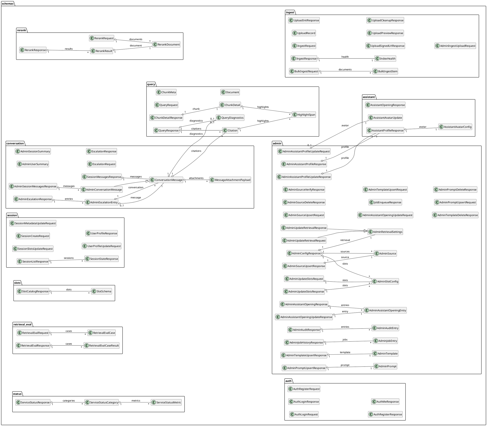

# Class Diagram (PlantUML)

## Core Runtime Classes

```plantuml
@startuml
hide empty members
skinparam classAttributeIconSize 0

package "agencies" {
  class HttpAPIAgency
}

package "agents" {
  class AttachmentContext
}

package "pipelines" {
  class IngestResult
  class UploadIngestJob
  class IngestJobQueue
}

package "schemas" {
  class QueryRequest
  class QueryResponse
  class IngestRequest
  class IngestResponse
  class Document
  class IndexHealth
  class SessionStateResponse
  class UserProfileResponse
  class AdminIngestUploadRequest
  class JobEnqueueResponse
  class ServiceStatusResponse
}

package "schemas.slots" {
  class SlotDefinition
}

package "utils.chunking" {
  class Chunk
}

package "utils.index" {
  class Retrieved
  interface DenseEmbedder
  class SiliconFlowEmbedder
  class DummyEmbedder
  class HybridIndex
}

package "utils.faiss_index" {
  class FaissIndex
}

package "utils.index_manager" {
  class IndexManager
}

package "utils.rerank" {
  class SiliconFlowReranker
}

package "utils.observability" {
  class RequestMetrics
}

package "utils.conversation_store" {
  class ConversationStore
}

package "utils.session" {
  class SessionState
  class SessionStore
}

package "utils.prompt_catalog" {
  class PromptSegment
  class PromptCatalog
}

package "utils.security" {
  class Principal
  class RateLimiter
}

package "utils.upload_signing" {
  class SignedUploadUrl
}

package "utils.text_extract" {
  class ExtractedText
}

package "utils.user_store" {
  class UserAccount
}

package "utils.siliconflow" {
  class SiliconFlowConfigError
  class _CircuitBreaker
}

DenseEmbedder <|.. SiliconFlowEmbedder
DenseEmbedder <|.. DummyEmbedder

HybridIndex ..> DenseEmbedder
FaissIndex ..> DenseEmbedder
HybridIndex ..> Retrieved
FaissIndex ..> Retrieved

IndexManager ..> HybridIndex
IndexManager ..> FaissIndex
IndexManager ..> Retrieved
IndexManager ..> IndexHealth

SiliconFlowReranker ..> Retrieved

IngestResult *-- Document
IngestJobQueue o-- UploadIngestJob
UploadIngestJob *-- AdminIngestUploadRequest
IngestJobQueue ..> IngestResponse
IngestJobQueue ..> JobEnqueueResponse

HttpAPIAgency ..> QueryRequest
HttpAPIAgency ..> QueryResponse
HttpAPIAgency ..> IngestRequest
HttpAPIAgency ..> IngestResult

ConversationStore ..> SessionStateResponse
ConversationStore ..> UserProfileResponse

SessionStore o-- SessionState
SessionStore ..> SessionStateResponse

PromptCatalog *-- PromptSegment
RequestMetrics ..> ServiceStatusResponse
@enduml
```

## Schema Models

```plantuml
@startuml
hide empty members
skinparam classAttributeIconSize 0
left to right direction

package "schemas.query" {
  class QueryRequest
  class QueryResponse
  class QueryDiagnostics
  class Citation
  class HighlightSpan
  class ChunkMeta
  class ChunkDetail
  class ChunkDetailResponse
  class Document
}

package "schemas.rerank" {
  class RerankDocument
  class RerankRequest
  class RerankResult
  class RerankResponse
}

package "schemas.conversation" {
  class MessageAttachmentPayload
  class ConversationMessage
  class SessionMessagesResponse
    class AdminConversationMessage
    class AdminSessionMessagesResponse
    class AdminUserSummary
    class AdminSessionSummary
  class EscalationRequest
  class EscalationResponse
  class AdminEscalationEntry
  class AdminEscalationResponse
}

package "schemas.session" {
  class SessionStateResponse
  class SessionListResponse
  class SessionSlotsUpdateRequest
  class SessionCreateRequest
  class SessionMetadataUpdateRequest
  class UserProfileUpdateRequest
  class UserProfileResponse
}

package "schemas.slots" {
  class SlotSchema
  class SlotCatalogResponse
}

package "schemas.ingest" {
  class IndexHealth
  class IngestRequest
  class IngestResponse
  class BulkIngestItem
  class BulkIngestRequest
  class UploadRecord
  class UploadInitResponse
  class UploadSignedUrlResponse
  class UploadPreviewResponse
  class UploadCleanupResponse
  class AdminIngestUploadRequest
}

package "schemas.retrieval_eval" {
  class RetrievalEvalCase
  class RetrievalEvalRequest
  class RetrievalEvalCaseResult
  class RetrievalEvalResponse
}

package "schemas.admin" {
  class AdminSource
  class AdminSourceUpsertRequest
  class AdminSourceUpsertResponse
  class AdminSourceDeleteResponse
  class AdminSourceVerifyResponse
  class AdminSlotConfig
  class AdminRetrievalSettings
  class AdminConfigResponse
  class AdminUpdateRetrievalRequest
  class AdminUpdateRetrievalResponse
  class AdminUpdateSlotsRequest
  class AdminUpdateSlotsResponse
  class AdminAssistantOpeningEntry
  class AdminAssistantOpeningResponse
  class AdminAssistantOpeningUpdateRequest
  class AdminAssistantOpeningUpdateResponse
  class AdminAuditEntry
  class AdminAuditResponse
  class AdminJobEntry
  class AdminJobHistoryResponse
  class JobEnqueueResponse
  class AdminTemplate
  class AdminTemplateUpsertRequest
  class AdminTemplateUpsertResponse
  class AdminTemplateDeleteResponse
  class AdminPrompt
  class AdminPromptUpsertRequest
  class AdminPromptUpsertResponse
  class AdminPromptDeleteResponse
  class AdminAssistantProfileResponse
  class AdminAssistantProfileUpdateRequest
  class AdminAssistantProfileUpdateResponse
}

package "schemas.auth" {
  class AuthLoginRequest
  class AuthLoginResponse
  class AuthRegisterRequest
  class AuthRegisterResponse
  class AuthMeResponse
}

package "schemas.assistant" {
  class AssistantOpeningResponse
  class AssistantAvatarConfig
  class AssistantProfileResponse
  class AssistantAvatarUpdate
}

package "schemas.status" {
  class ServiceStatusMetric
  class ServiceStatusCategory
  class ServiceStatusResponse
}

QueryResponse "1" o-- "*" Citation : citations
QueryResponse "1" o-- "0..1" QueryDiagnostics : diagnostics
Citation "1" o-- "*" HighlightSpan : highlights
ChunkDetail "1" o-- "*" HighlightSpan : highlights
ChunkDetailResponse "1" o-- "1" ChunkDetail : chunk

RerankRequest "1" o-- "*" RerankDocument : documents
RerankResult "1" o-- "1" RerankDocument : document
RerankResponse "1" o-- "*" RerankResult : results

ConversationMessage "1" o-- "*" Citation : citations
ConversationMessage "1" o-- "0..1" QueryDiagnostics : diagnostics
ConversationMessage "1" o-- "*" MessageAttachmentPayload : attachments
AdminConversationMessage --|> ConversationMessage
SessionMessagesResponse "1" o-- "*" ConversationMessage : messages
AdminSessionMessagesResponse "1" o-- "*" AdminConversationMessage : messages

AdminEscalationEntry "0..1" o-- "1" ConversationMessage : message
AdminEscalationEntry "1" o-- "*" ConversationMessage : conversation
AdminEscalationResponse "1" o-- "*" AdminEscalationEntry : entries

SessionListResponse "1" o-- "*" SessionStateResponse : sessions
SlotCatalogResponse "1" o-- "*" SlotSchema : slots
IngestResponse "1" o-- "1" IndexHealth : health
BulkIngestRequest "1" o-- "*" BulkIngestItem : documents

RetrievalEvalRequest "1" o-- "*" RetrievalEvalCase : cases
RetrievalEvalResponse "1" o-- "*" RetrievalEvalCaseResult : cases

AdminSourceUpsertResponse "1" o-- "1" AdminSource : source
AdminConfigResponse "1" o-- "*" AdminSource : sources
AdminConfigResponse "1" o-- "*" AdminSlotConfig : slots
AdminConfigResponse "1" o-- "1" AdminRetrievalSettings : retrieval
AdminUpdateRetrievalRequest --|> AdminRetrievalSettings
AdminUpdateRetrievalResponse --|> AdminRetrievalSettings
AdminUpdateSlotsRequest "1" o-- "*" AdminSlotConfig : slots
AdminUpdateSlotsResponse "1" o-- "*" AdminSlotConfig : slots
AdminAssistantOpeningResponse "1" o-- "*" AdminAssistantOpeningEntry : entries
AdminAssistantOpeningUpdateResponse "1" o-- "1" AdminAssistantOpeningEntry : entry
AdminAuditResponse "1" o-- "*" AdminAuditEntry : entries
AdminJobHistoryResponse "1" o-- "*" AdminJobEntry : jobs
AdminTemplateUpsertResponse "1" o-- "1" AdminTemplate : template
AdminPromptUpsertResponse "1" o-- "1" AdminPrompt : prompt

AssistantProfileResponse "1" o-- "1" AssistantAvatarConfig : avatar
AdminAssistantProfileResponse "1" o-- "1" AssistantProfileResponse : profile
AdminAssistantProfileUpdateRequest "0..1" o-- "1" AssistantAvatarUpdate : avatar
AdminAssistantProfileUpdateResponse "1" o-- "1" AssistantProfileResponse : profile

ServiceStatusCategory "1" o-- "*" ServiceStatusMetric : metrics
ServiceStatusResponse "1" o-- "*" ServiceStatusCategory : categories
@enduml
```
