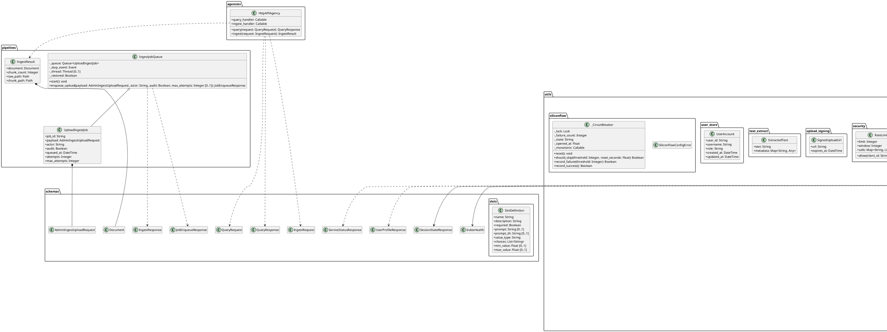

# Core Runtime Class Diagram (PlantUML)

```plantuml
@startuml
hide empty members
skinparam classAttributeIconSize 0

package "agencies" {
  class HttpAPIAgency {
    +query_handler: Callable
    +ingest_handler: Callable
    +query(request: QueryRequest): QueryResponse
    +ingest(request: IngestRequest): IngestResult
  }
}

package "agents" {
  class AttachmentContext {
    +text: String
    +images: List<String>
  }
}

package "pipelines" {
  class IngestResult {
    +document: Document
    +chunk_count: Integer
    +raw_path: Path
    +chunk_path: Path
  }

  class UploadIngestJob {
    +job_id: String
    +payload: AdminIngestUploadRequest
    +actor: String
    +audit: Boolean
    +queued_at: DateTime
    +attempts: Integer
    +max_attempts: Integer
  }

  class IngestJobQueue {
    -_queue: Queue<UploadIngestJob>
    -_stop_event: Event
    -_thread: Thread [0..1]
    -_restored: Boolean
    +start(): void
    +enqueue_upload(payload: AdminIngestUploadRequest, actor: String, audit: Boolean, max_attempts: Integer [0..1]): JobEnqueueResponse
  }
}

package "schemas" {
  class QueryRequest
  class QueryResponse
  class IngestRequest
  class IngestResponse
  class Document
  class IndexHealth
  class SessionStateResponse
  class UserProfileResponse
  class AdminIngestUploadRequest
  class JobEnqueueResponse
  class ServiceStatusResponse
}

package "schemas.slots" {
  class SlotDefinition {
    +name: String
    +description: String
    +required: Boolean
    +prompt: String [0..1]
    +prompt_zh: String [0..1]
    +value_type: String
    +choices: List<String>
    +min_value: Float [0..1]
    +max_value: Float [0..1]
  }
}

package "utils.chunking" {
  class Chunk {
    +doc_id: String
    +chunk_id: String
    +text: String
    +start_idx: Integer
    +end_idx: Integer
    +metadata: Map<String, Any>
  }
}

package "utils.index" {
  class Retrieved {
    +chunk_id: String
    +text: String
    +score: Float
    +meta: Map<String, Any>
  }

  abstract class DenseEmbedder {
    +embed(texts: List<String>): List<List<Float>>
  }

  class SiliconFlowEmbedder {
    +model: String [0..1]
    +embed(texts: List<String>): List<List<Float>>
  }

  class DummyEmbedder {
    +embed(texts: List<String>): List<List<Float>>
  }

  class HybridIndex {
    -ids: List<String>
    -texts: List<String>
    -metas: List<Map<String, Any>>
    -bm25: BM25Okapi
    -embedder: DenseEmbedder
    -embeddings: List<List<Float>>
    +query(q: String, top_k: Integer, alpha: Float): List<Retrieved>
  }
}

package "utils.faiss_index" {
  class FaissIndex {
    -ids: List<String>
    -texts: List<String>
    -metas: List<Map<String, Any>>
    -embedder: DenseEmbedder
    -_index: IndexFlatIP
    +query(q: String, top_k: Integer): List<Retrieved>
  }
}

package "utils.index_manager" {
  class IndexManager {
    +alpha: Float
    +default_top_k: Integer
    +default_k_cite: Integer
    +index_backend: String
    +last_build_at: DateTime [0..1]
    +document_count: Integer
    +chunk_count: Integer
    +errors: List<String>
    +configure(alpha: Float [0..1], top_k: Integer [0..1], k_cite: Integer [0..1]): void
    +rebuild(): void
    +query(query: String, top_k: Integer, alpha: Float [0..1]): List<Retrieved>
    +health(): IndexHealth
    +summary(): Map<String, Any>
  }
}

package "utils.rerank" {
  class SiliconFlowReranker {
    +model: String [0..1]
    +rerank(query: String, items: List<Retrieved>, trace_id: String [0..1], language: String [0..1]): List<Retrieved>
  }
}

package "utils.observability" {
  class RequestMetrics {
    +record(endpoint: String, duration_ms: Float): void
    +record_phase(phase: String, duration_ms: Float): void
    +record_empty_retrieval(): void
    +record_rerank_fallback(): void
    +record_low_confidence(): void
    +record_citation_coverage(citation_count: Integer, required: Integer): void
    +record_retrieval_eval(recall_at_k: Float, mrr: Float, k: Integer): void
    +increment_counter(name: String, amount: Float): void
    +snapshot(): Map<String, Any>
    +record_snapshot(snapshot: Map<String, Any>): void
    +history(limit: Integer): List<Map<String, Any>>
    +reset(): void
  }
}

package "utils.conversation_store" {
  class ConversationStore {
    +list_users(limit: Integer [0..1]): List<Map<String, Any>>
    +list_sessions_admin(user_id: String [0..1], limit: Integer [0..1]): List<Map<String, Any>>
    +list_messages_admin(user_id: String, session_id: String): List<Map<String, Any>>
    +get_profile(user_id: String): UserProfileResponse
    +update_profile(user_id: String, updates: Map<String, Any>): UserProfileResponse
    +list_sessions(user_id: String): List<SessionStateResponse>
    +count_sessions(): Integer
    +get_session(user_id: String, session_id: String): SessionStateResponse [0..1]
    +create_session(user_id: String, title: String [0..1], language: String [0..1], session_id: String [0..1]): SessionStateResponse
    +upsert_session(user_id: String, session_id: String [0..1], language: String, slot_updates: Map<String, Any> [0..1], reset_slots: List<String>): SessionStateResponse
    +update_session_metadata(user_id: String, session_id: String, title: String [0..1], pinned: Boolean [0..1], archived: Boolean [0..1]): SessionStateResponse [0..1]
    +delete_session(user_id: String, session_id: String): Boolean
    +list_messages(user_id: String, session_id: String): List<Map<String, Any>>
    +append_message(user_id: String, session_id: String, message: Map<String, Any>): void
    +build_attachment_records(upload_ids: List<String>): List<Map<String, Any>>
  }
}

package "utils.session" {
  class SessionState {
    +session_id: String
    +slots: Map<String, Any>
    +slot_errors: Map<String, String>
    +language: String
    +created_at: DateTime
    +updated_at: DateTime
    +copy(): SessionState
  }

  class SessionStore {
    +ttl_seconds: Integer
    -_sessions: Map<String, SessionState>
    -_lock: Lock
    +get(session_id: String): SessionState [0..1]
    +upsert(session_id: String [0..1], language: String, slot_updates: Map<String, Any> [0..1], reset_slots: List<String>): SessionState
    +clear(session_id: String): void
    +clear_all(): void
    +export(session_id: String): SessionStateResponse [0..1]
    +list_sessions(): List<SessionStateResponse>
    +snapshot(): Map<String, SessionState>
  }
}

package "utils.prompt_catalog" {
  class PromptSegment {
    +key: String
    +template_en: String
    +template_zh: String
  }

  class PromptCatalog {
    +segments: List<PromptSegment>
    +fragments: Map<String, Map<String, String>>
  }
}

package "utils.security" {
  class Principal {
    +role: String
    +actor: String
    +sub: String
    +method: String
  }

  class RateLimiter {
    +limit: Integer
    +window: Integer
    +calls: Map<String, List<Float>>
    +allow(client_id: String): void
  }
}

package "utils.upload_signing" {
  class SignedUploadUrl {
    +url: String
    +expires_at: DateTime
  }
}

package "utils.text_extract" {
  class ExtractedText {
    +text: String
    +metadata: Map<String, Any>
  }
}

package "utils.user_store" {
  class UserAccount {
    +user_id: String
    +username: String
    +role: String
    +created_at: DateTime
    +updated_at: DateTime
  }
}

package "utils.siliconflow" {
  class SiliconFlowConfigError

  class _CircuitBreaker {
    -_lock: Lock
    -_failure_count: Integer
    -_state: String
    -_opened_at: Float
    -_monotonic: Callable
    +reset(): void
    +should_skip(threshold: Integer, reset_seconds: Float): Boolean
    +record_failure(threshold: Integer): Boolean
    +record_success(): Boolean
  }
}

DenseEmbedder <|-- SiliconFlowEmbedder
DenseEmbedder <|-- DummyEmbedder

HybridIndex --> DenseEmbedder
FaissIndex --> DenseEmbedder
HybridIndex --> Retrieved
FaissIndex --> Retrieved

IndexManager --> HybridIndex
IndexManager --> FaissIndex
IndexManager --> Retrieved
IndexManager --> IndexHealth

SiliconFlowReranker --> Retrieved

IngestResult *-- Document
IngestJobQueue o-- UploadIngestJob
UploadIngestJob *-- AdminIngestUploadRequest
IngestJobQueue ..> IngestResponse
IngestJobQueue ..> JobEnqueueResponse

HttpAPIAgency ..> QueryRequest
HttpAPIAgency ..> QueryResponse
HttpAPIAgency ..> IngestRequest
HttpAPIAgency ..> IngestResult

ConversationStore ..> SessionStateResponse
ConversationStore ..> UserProfileResponse

SessionStore o-- SessionState
SessionStore ..> SessionStateResponse

PromptCatalog *-- PromptSegment
RequestMetrics ..> ServiceStatusResponse
@enduml
```
