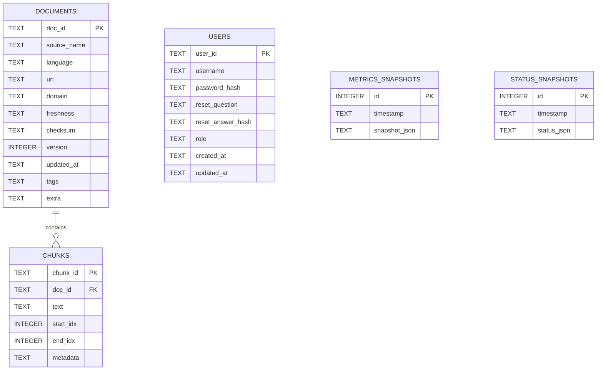

# Database Schema (SQLite)

This project uses a local SQLite database for metadata storage.
The database file is created at `assets/data/processed/metadata.sqlite`
by `src/utils/storage.py`.

## ERD

## Tables

### documents

- doc_id: TEXT, PRIMARY KEY
- source_name: TEXT, NOT NULL
- language: TEXT, nullable
- url: TEXT, nullable
- domain: TEXT, nullable
- freshness: TEXT, nullable
- checksum: TEXT, nullable
- version: INTEGER, NOT NULL
- updated_at: TEXT, NOT NULL (ISO timestamp)
- tags: TEXT, nullable (JSON array)
- extra: TEXT, nullable (JSON object)

### chunks

- chunk_id: TEXT, PRIMARY KEY
- doc_id: TEXT, NOT NULL, FOREIGN KEY -> documents.doc_id (ON DELETE CASCADE)
- text: TEXT, NOT NULL
- start_idx: INTEGER, nullable
- end_idx: INTEGER, nullable
- metadata: TEXT, nullable (JSON object)

Indexes:
- idx_chunks_doc_id on chunks(doc_id)

### users

- user_id: TEXT, PRIMARY KEY
- username: TEXT, NOT NULL, UNIQUE
- password_hash: TEXT, NOT NULL
- reset_question: TEXT, nullable
- reset_answer_hash: TEXT, nullable
- role: TEXT, NOT NULL
- created_at: TEXT, NOT NULL (ISO timestamp)
- updated_at: TEXT, NOT NULL (ISO timestamp)

Indexes:
- idx_users_username on users(username)

### metrics_snapshots

- id: INTEGER, PRIMARY KEY AUTOINCREMENT
- timestamp: TEXT, NOT NULL (ISO timestamp)
- snapshot_json: TEXT, NOT NULL (JSON object)

### status_snapshots

- id: INTEGER, PRIMARY KEY AUTOINCREMENT
- timestamp: TEXT, NOT NULL (ISO timestamp)
- status_json: TEXT, NOT NULL (JSON object)

## Notes

- Foreign keys are enabled via `PRAGMA foreign_keys = ON`.
- The metadata database is initialized and migrated from JSON files on first use.
