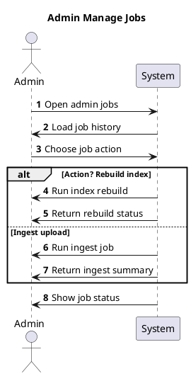

# Admin Manage Jobs

```plantuml
@startuml
title Admin Manage Jobs
autonumber
actor Admin
participant System

Admin -> System : Open admin jobs
System -> Admin : Load job history
Admin -> System : Choose job action
alt Action? Rebuild index
  System -> Admin : Run index rebuild
  System -> Admin : Return rebuild status
else Ingest upload
  System -> Admin : Run ingest job
  System -> Admin : Return ingest summary
end
System -> Admin : Show job status
@enduml
```
