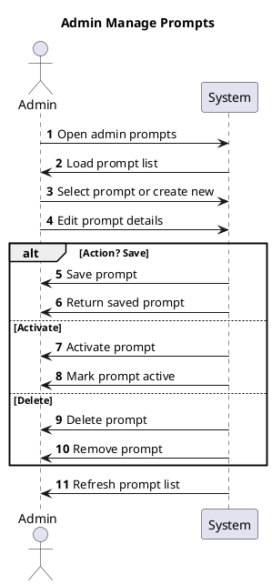

# Admin Manage Prompts

```plantuml
@startuml
title Admin Manage Prompts
autonumber
actor Admin
participant System

Admin -> System : Open admin prompts
System -> Admin : Load prompt list
Admin -> System : Select prompt or create new
Admin -> System : Edit prompt details
alt Action? Save
  System -> Admin : Save prompt
  System -> Admin : Return saved prompt
else Activate
  System -> Admin : Activate prompt
  System -> Admin : Mark prompt active
else Delete
  System -> Admin : Delete prompt
  System -> Admin : Remove prompt
end
System -> Admin : Refresh prompt list
@enduml
```
