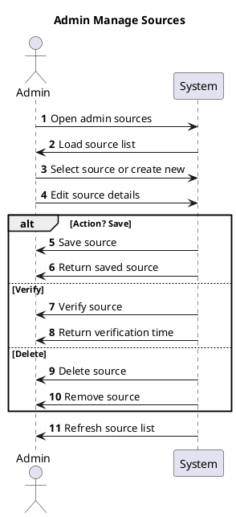

# Admin Manage Sources

```plantuml
@startuml
title Admin Manage Sources
autonumber
actor Admin
participant System

Admin -> System : Open admin sources
System -> Admin : Load source list
Admin -> System : Select source or create new
Admin -> System : Edit source details
alt Action? Save
  System -> Admin : Save source
  System -> Admin : Return saved source
else Verify
  System -> Admin : Verify source
  System -> Admin : Return verification time
else Delete
  System -> Admin : Delete source
  System -> Admin : Remove source
end
System -> Admin : Refresh source list
@enduml
```
