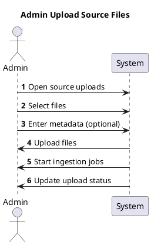

# Admin Upload Source Files

```plantuml
@startuml
title Admin Upload Source Files
autonumber
actor Admin
participant System

Admin -> System : Open source uploads
Admin -> System : Select files
Admin -> System : Enter metadata (optional)
System -> Admin : Upload files
System -> Admin : Start ingestion jobs
System -> Admin : Update upload status
@enduml
```
