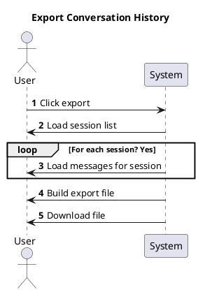

# Export Conversation History

```plantuml
@startuml
title Export Conversation History
autonumber
actor User
participant System

User -> System : Click export
System -> User : Load session list
loop For each session? Yes
  System -> User : Load messages for session
end
System -> User : Build export file
System -> User : Download file
@enduml
```
