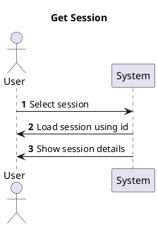

# Get Session

```plantuml
@startuml
title Get Session
autonumber
actor User
participant System

User -> System : Select session
System -> User : Load session using id
System -> User : Show session details
@enduml
```
