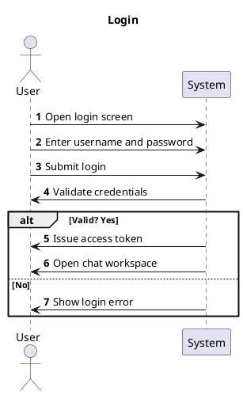

# Login

```plantuml
@startuml
title Login
autonumber
actor User
participant System

User -> System : Open login screen
User -> System : Enter username and password
User -> System : Submit login
System -> User : Validate credentials
alt Valid? Yes
  System -> User : Issue access token
  System -> User : Open chat workspace
else No
  System -> User : Show login error
end
@enduml
```
