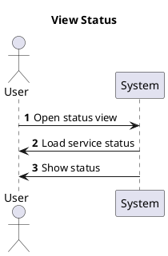

# View Status

```plantuml
@startuml
title View Status
autonumber
actor User
participant System

User -> System : Open status view
System -> User : Load service status
System -> User : Show status
@enduml
```
