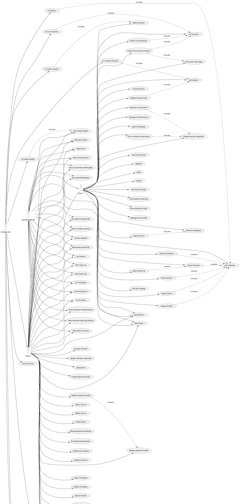

# Use Case Diagram (PlantUML)

```plantuml
@startuml
left to right direction

actor User as U
actor AdminReadOnly as AR
actor Admin as A
actor CLIOperator as C

A --|> U
AR --|> U
C --|> A

usecase "Register" as UC_Register
usecase "Login" as UC_Login
usecase "Logout" as UC_Logout
usecase "Get Auth Principal" as UC_AuthMe

usecase "Get Assistant Opening" as UC_AssistantOpening
usecase "View Assistant Profile" as UC_AssistantProfile
usecase "Manage User Profile" as UC_UserProfile
usecase "Submit Escalation" as UC_Escalation

usecase "List Sessions" as UC_SessionsList
usecase "Create Session" as UC_SessionCreate
usecase "Get Session" as UC_SessionGet
usecase "Delete Session" as UC_SessionDelete
usecase "Update Session Metadata" as UC_SessionUpdate
usecase "Update Session Slots" as UC_SessionSlots
usecase "List Session Messages" as UC_SessionMessages
usecase "Search Conversations" as UC_SearchConversations
usecase "Rename Conversation" as UC_RenameConversation
usecase "Pin or Archive Conversation" as UC_PinArchiveConversation
usecase "Export Conversation History" as UC_ExportConversations
usecase "Manage UI Preferences" as UC_UiPreferences

usecase "Ask Question" as UC_Query
usecase "Stream Answer" as UC_Stream
usecase "Stop Streaming" as UC_StopStream
usecase "View Citations" as UC_Citations
usecase "Submit Feedback" as UC_Feedback
usecase "Rerank Candidates" as UC_Rerank
usecase "Get Chunk Detail" as UC_ChunkDetail

usecase "Upload File" as UC_Upload
usecase "Get Upload Metadata" as UC_UploadGet
usecase "Get Upload Signed URL" as UC_UploadSigned
usecase "Preview Upload" as UC_UploadPreview
usecase "Download Upload File" as UC_UploadFile
usecase "Ingest Content" as UC_IngestContent
usecase "Ingest Upload" as UC_IngestUpload
usecase "Rebuild Index" as UC_Rebuild
usecase "View Index Health" as UC_IndexHealth

usecase "List Sources" as UC_SourcesList
usecase "Upsert Source" as UC_SourceUpsert
usecase "Delete Source" as UC_SourceDelete
usecase "Verify Source" as UC_SourceVerify
usecase "Manage Retrieval Settings" as UC_RetrievalSettings
usecase "Run Retrieval Evaluation" as UC_RetrievalEval
usecase "Get Slot Catalog" as UC_SlotCatalogGet
usecase "Update Slot Catalog" as UC_SlotCatalogUpdate
usecase "View Stop List" as UC_StopListView
usecase "Update Stop List" as UC_StopListUpdate
usecase "List Templates" as UC_TemplatesList
usecase "Upsert Template" as UC_TemplateUpsert
usecase "Delete Template" as UC_TemplateDelete
usecase "List Prompts" as UC_PromptsList
usecase "Upsert Prompt" as UC_PromptUpsert
usecase "Delete Prompt" as UC_PromptDelete
usecase "Activate Prompt" as UC_PromptActivate
usecase "View Assistant Profile (Admin)" as UC_AssistantProfileAdminView
usecase "Update Assistant Profile" as UC_AssistantProfileAdminUpdate
usecase "Update Assistant Avatar" as UC_AssistantAvatarAdminUpdate
usecase "View Assistant Opening (Admin)" as UC_AssistantOpeningAdminView
usecase "Update Assistant Opening" as UC_AssistantOpeningAdminUpdate

usecase "View Metrics" as UC_Metrics
usecase "View Metrics History" as UC_MetricsHistory
usecase "View Status" as UC_Status
usecase "View Audit Log" as UC_Audit
usecase "View Escalations" as UC_Escalations
usecase "View Job History" as UC_Jobs
usecase "View Users" as UC_Users
usecase "View Conversations" as UC_Conversations
usecase "View Conversation Messages" as UC_ConversationMessages
usecase "Purge Expired Uploads" as UC_UploadCleanup
usecase "Admin Config Snapshot" as UC_AdminConfig

usecase "Legacy Query" as UC_LegacyQuery
usecase "Legacy Answer" as UC_LegacyAnswer
usecase "Legacy Rerank" as UC_LegacyRerank
usecase "Legacy Ingest" as UC_LegacyIngest

usecase "CLI Run Server" as UC_CliServe
usecase "CLI Ingest File" as UC_CliIngest
usecase "CLI Ingest Bulk" as UC_CliIngestBulk
usecase "CLI Query" as UC_CliQuery
usecase "CLI List Sessions" as UC_CliSessionsList
usecase "CLI Inspect Session" as UC_CliSessionInspect
usecase "CLI Clear Session" as UC_CliSessionClear
usecase "CLI Index Health" as UC_CliIndexHealth
usecase "CLI Rebuild Index" as UC_CliRebuild

U --> UC_Register
U --> UC_Login
U --> UC_Logout
U --> UC_AuthMe
U --> UC_AssistantOpening
U --> UC_AssistantProfile
U --> UC_UserProfile
U --> UC_Escalation
U --> UC_SessionsList
U --> UC_SessionCreate
U --> UC_SessionGet
U --> UC_SessionDelete
U --> UC_SessionUpdate
U --> UC_SessionSlots
U --> UC_SessionMessages
U --> UC_SearchConversations
U --> UC_RenameConversation
U --> UC_PinArchiveConversation
U --> UC_ExportConversations
U --> UC_UiPreferences
U --> UC_SlotCatalogGet
U --> UC_Query
U --> UC_Stream
U --> UC_StopStream
U --> UC_Citations
U --> UC_Feedback
U --> UC_Rerank
U --> UC_ChunkDetail
U --> UC_Metrics
U --> UC_Status
U --> UC_LegacyQuery
U --> UC_LegacyAnswer
U --> UC_LegacyRerank

UC_Stream ..> UC_Query : <<extend>>
UC_Citations ..> UC_Query : <<extend>>
UC_StopStream ..> UC_Stream : <<extend>>
UC_Escalation ..> UC_Query : <<extend>>
UC_SessionSlots ..> UC_SessionGet : <<include>>
UC_SearchConversations ..> UC_SessionsList : <<include>>
UC_RenameConversation ..> UC_SessionUpdate : <<include>>
UC_PinArchiveConversation ..> UC_SessionUpdate : <<include>>
UC_ExportConversations ..> UC_SessionsList : <<include>>
UC_ExportConversations ..> UC_SessionMessages : <<include>>

AR --> UC_IndexHealth
AR --> UC_SourcesList
AR --> UC_Metrics
AR --> UC_MetricsHistory
AR --> UC_Status
AR --> UC_StopListView
AR --> UC_TemplatesList
AR --> UC_PromptsList
AR --> UC_Audit
AR --> UC_Escalations
AR --> UC_Jobs
AR --> UC_Users
AR --> UC_Conversations
AR --> UC_ConversationMessages
AR --> UC_AdminConfig
AR --> UC_AssistantOpeningAdminView
AR --> UC_AssistantProfileAdminView
AR --> UC_UploadGet
AR --> UC_UploadSigned
AR --> UC_UploadPreview
AR --> UC_UploadFile

A --> UC_Upload
A --> UC_UploadGet
A --> UC_UploadSigned
A --> UC_UploadPreview
A --> UC_UploadFile
A --> UC_IngestContent
A --> UC_IngestUpload
A --> UC_UploadCleanup
A --> UC_Rebuild
A --> UC_IndexHealth
A --> UC_SourcesList
A --> UC_SourceUpsert
A --> UC_SourceDelete
A --> UC_SourceVerify
A --> UC_RetrievalSettings
A --> UC_RetrievalEval
A --> UC_SlotCatalogUpdate
A --> UC_StopListView
A --> UC_StopListUpdate
A --> UC_TemplatesList
A --> UC_TemplateUpsert
A --> UC_TemplateDelete
A --> UC_PromptsList
A --> UC_PromptUpsert
A --> UC_PromptDelete
A --> UC_PromptActivate
A --> UC_AssistantProfileAdminView
A --> UC_AssistantProfileAdminUpdate
A --> UC_AssistantAvatarAdminUpdate
A --> UC_AssistantOpeningAdminView
A --> UC_AssistantOpeningAdminUpdate
A --> UC_Metrics
A --> UC_MetricsHistory
A --> UC_Status
A --> UC_Audit
A --> UC_Escalations
A --> UC_Jobs
A --> UC_Users
A --> UC_Conversations
A --> UC_ConversationMessages
A --> UC_AdminConfig
A --> UC_LegacyIngest

UC_IngestUpload ..> UC_Rebuild : <<include>>
UC_IngestContent ..> UC_Rebuild : <<include>>
UC_AssistantAvatarAdminUpdate ..> UC_AssistantProfileAdminUpdate : <<extend>>
UC_LegacyQuery ..> UC_Query : <<include>>
UC_LegacyAnswer ..> UC_Query : <<include>>
UC_LegacyRerank ..> UC_Rerank : <<include>>
UC_LegacyIngest ..> UC_IngestContent : <<include>>

C --> UC_CliServe
C --> UC_CliIngest
C --> UC_CliIngestBulk
C --> UC_CliQuery
C --> UC_CliSessionsList
C --> UC_CliSessionInspect
C --> UC_CliSessionClear
C --> UC_CliIndexHealth
C --> UC_CliRebuild

UC_CliIngest ..> UC_IngestContent : <<include>>
UC_CliIngest ..> UC_Rebuild : <<include>>
UC_CliIngestBulk ..> UC_IngestContent : <<include>>
UC_CliIngestBulk ..> UC_Rebuild : <<include>>
UC_CliQuery ..> UC_Query : <<include>>
UC_CliSessionsList ..> UC_SessionsList : <<include>>
UC_CliSessionInspect ..> UC_SessionGet : <<include>>
UC_CliSessionClear ..> UC_SessionDelete : <<include>>
UC_CliIndexHealth ..> UC_IndexHealth : <<include>>
UC_CliRebuild ..> UC_Rebuild : <<include>>

@enduml
```
